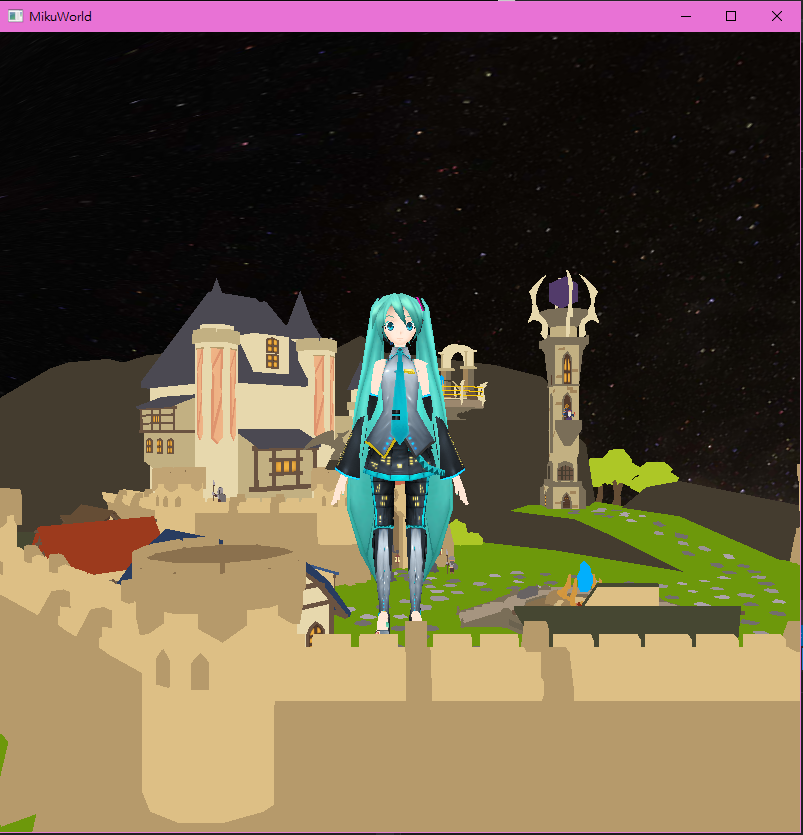
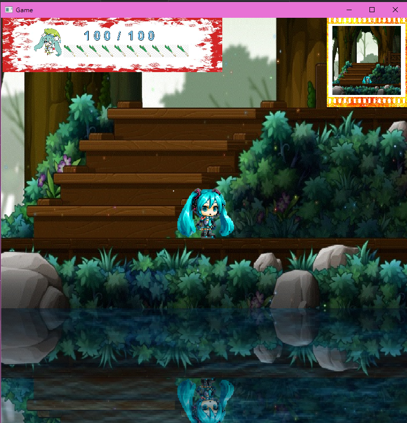
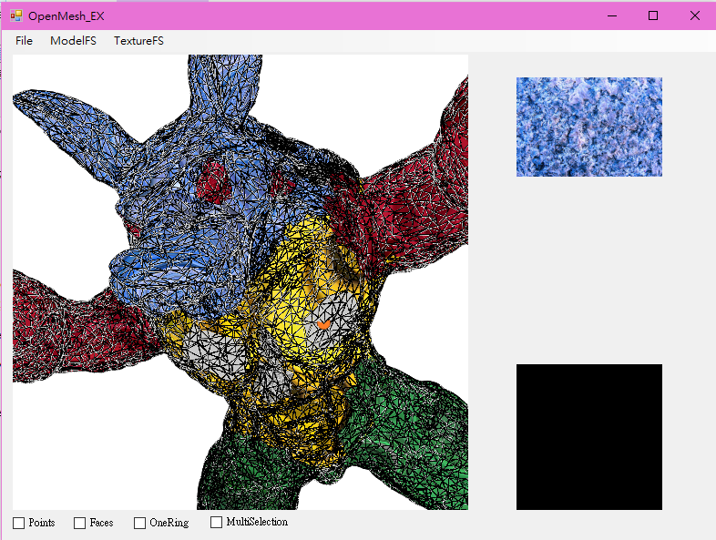
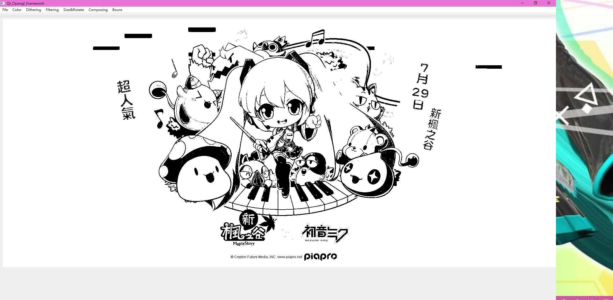
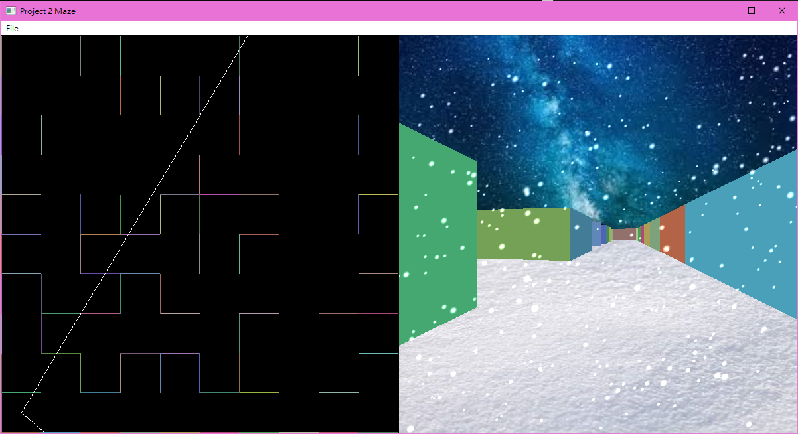
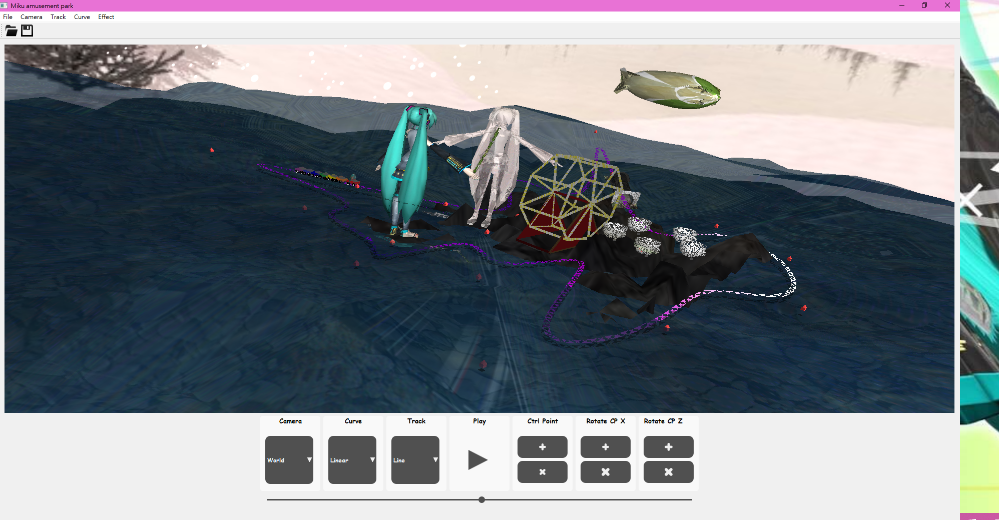

# NTUST Computer graphics project
# Table of Contents
* Background
* Install&Usage
* Feature
<!-- * Miku robot
* Miku in maple world
* Texture parameterization
* Tiny photoshop
* Maze
* Amusement park -->
# Background
學習電腦圖學基礎技術。
# Install&Usage
安裝Visual studio2017與Qt5.8，開啟專案並執行。
# Feature
1. Miku robot: 載入3D模型，計算transform矩陣，完成如揮手、甩蔥、跳舞、鞠躬等動作，並透過fragment shader製作特效做後處理。
 
 

2. Miku in maple world: 2D橫向卷軸遊戲，共有三個關卡，結合解謎與動作的元素。核心技術為array texture的使用，以及用FBO機制產生小地圖與湖面反射。 
 

3. Texture parameterization: 載入任意3D白模與任意貼圖，將貼圖參數化貼至模型上。可單點選取、框選來貼上貼圖，最後，使用fragment shader製作特效做後處理。 
 

4. Tiny photoshop: 讀取圖片做Color sampling、filtering(Box、Gaussian、Mean)、Dither、縮放、旋轉 
 

5. Maze: 不使用OpenG內建的modelview及projection矩陣，自行計算Model, Veiw, Projection矩陣將2D的平面迷宮轉換成3D立體迷宮，並使用fragment shader製作特效做後處理。 
 

6. Amusement park: 在3D空間繪製linear直線、 C1和C2曲線來生成雲霄飛車的軌道。使用Noise map及Height map sampleing模擬水面起伏，並在fragment shader計算水面反射其折射。另外載入3D model、使用skybox豐富場景，並加入大量特效作後處理。
  